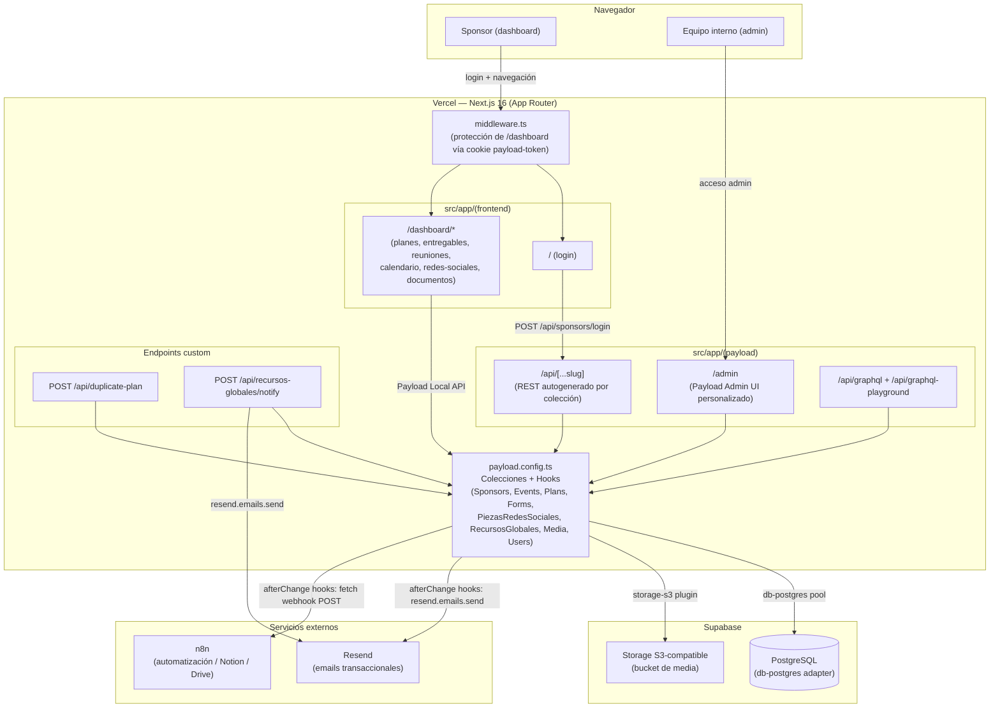

## Visión general

Sponsors Hub CT es una **aplicación monolítica Next.js** que embebe **Payload CMS** en el mismo proceso (no hay un backend separado). Payload se monta dentro del App Router mediante `withPayload()` (`next.config.ts`) y expone su Admin UI, su API REST y su API GraphQL como rutas de Next.js dentro del grupo `src/app/(payload)/`.

## Componentes principales

### 1. Next.js App Router

- **`src/app/(frontend)/`** — rutas públicas: login (`/`) y el dashboard del sponsor (`/dashboard/*`). Son Server Components que leen la cookie `payload-token`, autentican contra Payload (`payload.auth(...)`) y redirigen a `/` si no hay sesión válida.
- **`src/app/(payload)/`** — rutas generadas/gestionadas por Payload: el Admin UI (`/admin`), el REST catch-all (`/api/[...slug]`) y GraphQL (`/api/graphql`, `/api/graphql-playground`). Estos archivos de ruta son generados automáticamente por Payload y no deben editarse a mano (llevan el comentario `THIS FILE WAS GENERATED AUTOMATICALLY BY PAYLOAD`).
- **`middleware.ts`** — capa adicional de protección de rutas a nivel de Next.js: redirige a `/` cualquier request a `/dashboard/*` sin cookie `payload-token`, y redirige a `/dashboard` cualquier request a `/` que ya tenga token.
- **Endpoints custom** fuera del CRUD autogenerado: `POST /api/duplicate-plan` y `POST /api/recursos-globales/notify` (ver [API Reference](/api-reference)).

### 2. Payload CMS (`src/payload.config.ts`)

Es el núcleo de la aplicación: define las 8 colecciones de negocio/sistema, el editor de texto enriquecido (Lexical), el adaptador de base de datos, el plugin de almacenamiento S3 y las personalizaciones del Admin UI (logo, vistas custom, componentes de campo custom). Ver [Base de datos](/database) para el detalle de cada colección.

La lógica de negocio (clonado de beneficios/entregables, sincronización Plan↔Sponsor, envío de emails, disparo de webhooks) vive en **hooks de colección** (`beforeChange`, `afterChange`), no en servicios o controladores separados — es el patrón nativo de Payload.

### 3. Autenticación

Hay **dos colecciones con auth habilitado**:

- `users` (`auth: { useAPIKey: true }`) — usuarios internos del admin, con soporte de API Key además de login por sesión.
- `sponsors` (`auth: true`) — cada sponsor es, literalmente, un usuario autenticable de Payload. El login del dashboard llama directamente a `POST /api/sponsors/login` (endpoint de auth autogenerado por Payload para la colección `sponsors`), y Payload responde seteando la cookie httpOnly `payload-token`.

No hay un sistema de roles/RBAC explícito (no se encontró un campo `roles` en `Users` ni funciones de `access` personalizadas en la mayoría de colecciones, más allá de `Media.access.read`).  
**TODO**: confirmar si esto es intencional (acceso "todo o nada" dentro del admin) o si falta definir `access` control por colección — no está documentado en el código ni en `AGENTS.md`.

### 4. Base de datos — Supabase Postgres

Payload se conecta directamente a Postgres vía `@payloadcms/db-postgres` (que usa `pg` internamente) usando la cadena `DATABASE_URL`. Esto es una **conexión directa a Postgres**, no a través de la API PostgREST de Supabase — por lo tanto **Row Level Security (RLS) de Supabase no aplica** a este flujo (Payload aplica su propio control de acceso a nivel de aplicación, si está definido). Ver [Base de datos](/database) para más detalle.

### 5. Almacenamiento de archivos — Supabase Storage (S3-compatible)

El plugin `@payloadcms/storage-s3` intercepta la colección `media` y sube los archivos al bucket S3 configurado (`S3_BUCKET`) usando el endpoint S3-compatible de Supabase Storage (`S3_ENDPOINT`), con `forcePathStyle: true` (requisito explícito de Supabase, documentado en un comentario del propio `payload.config.ts`).

### 6. Emails transaccionales — Resend

Se usa el SDK `resend` directamente dentro de los hooks `afterChange` de `Sponsors` y en los endpoints custom, con plantillas React Email (`src/emails/*.tsx`). El remitente está hardcodeado: `Colombia Tech <hola@sponsor.colombiatechweek.co>`.

### 7. Automatización externa — n8n

Tres webhooks salientes (HTTP POST, disparados con `fetch`) desde el hook `afterChange` de `Sponsors`:

- `N8N_WEBHOOK_URL` — sincroniza el perfil completo del sponsor (contacto, estrategia, eventos, planes, logo) hacia Notion.
- `N8N_WEBHOOK_REUNIONES_URL` — notifica cambios de reuniones (solo envía `sponsorId`).
- `N8N_WEBHOOK_DRIVE_URL` — cuando se sube un entregable cuyo nombre contiene "logo", envía la URL pública del archivo para que n8n lo suba a Google Drive.

No hay webhooks entrantes (Sponsors Hub CT no expone endpoints para que n8n le escriba de vuelta) — la relación es unidireccional, saliente.

## Flujo de datos típico: alta y seguimiento de un sponsor

1. El equipo interno crea un `Sponsor` desde el Admin UI, asignándole un `Event` y un `Plan` dentro de `eventParticipations[]`.
2. El hook `beforeChange` de `Sponsors` clona automáticamente las `meetings` (desde `event.meetingTemplates`) y los `deliverables`/`benefitItems` (desde `plan.benefits`).
3. El hook `afterChange` de `Sponsors` envía el email de bienvenida (Resend) con la contraseña temporal, y dispara los webhooks hacia n8n.
4. El sponsor inicia sesión en `/` (`POST /api/sponsors/login`) y navega su dashboard (`/dashboard/*`), donde ve su plan, entregables, reuniones y calendario.
5. El sponsor sube un entregable o el equipo interno sube una evidencia → el hook `afterChange` de `Sponsors` detecta el cambio y envía el email correspondiente ("nueva evidencia", "nuevo recurso", "nueva pieza de redes sociales").
6. Si el `Plan` o el `Event` asignado se edita después, sus respectivos hooks `afterChange` recorren todos los sponsors afectados y sincronizan los cambios (sin pisar personalizaciones marcadas `source: 'custom'`).
