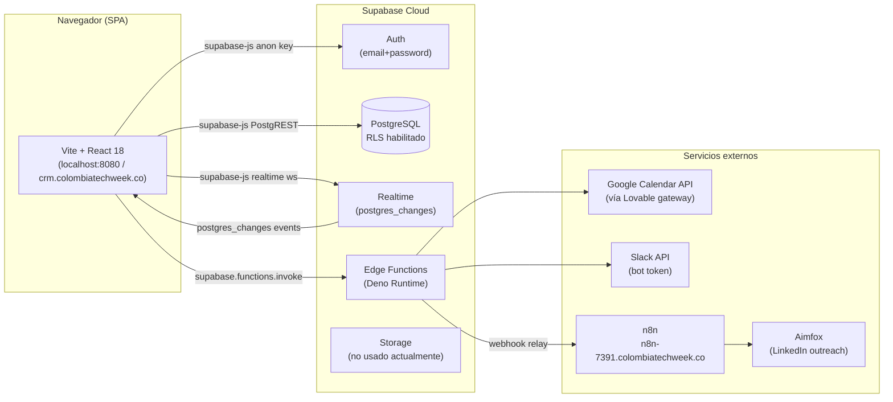
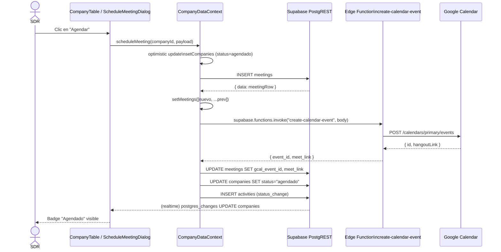
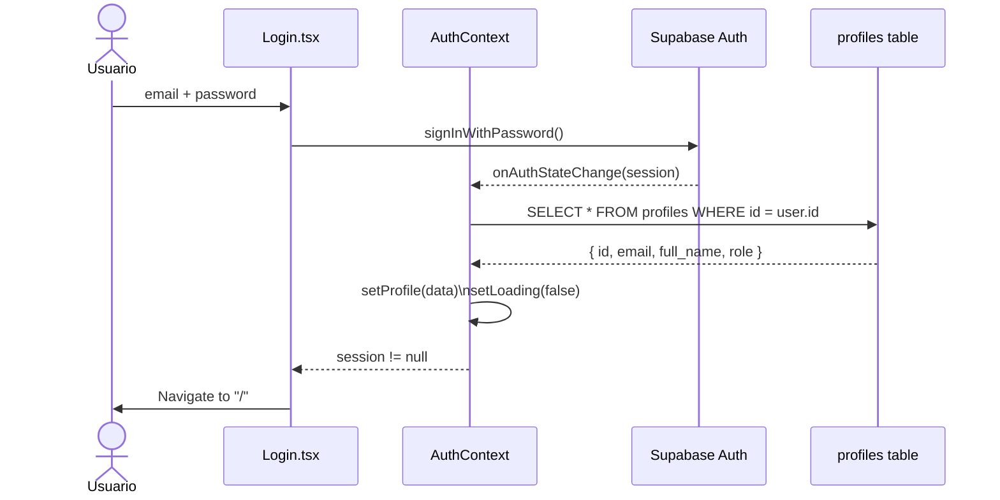
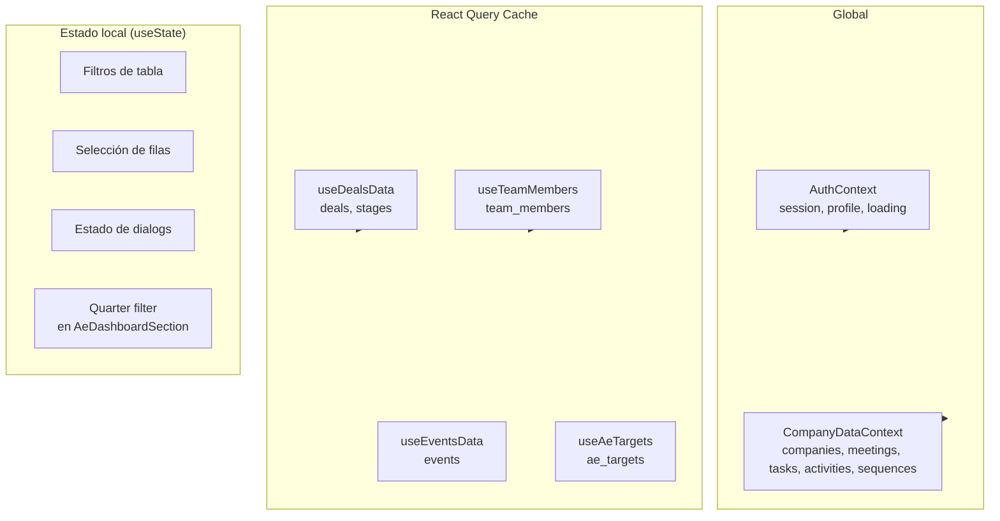

## Visión general

El sistema es una **SPA (Single Page Application)** construida con React + Vite que se comunica directamente con Supabase desde el navegador. No hay un servidor intermedio propio — toda la lógica de negocio sensible vive en Supabase Edge Functions (Deno) o en políticas RLS de PostgreSQL.



## Flujo de request típico: agendar una reunión



## Flujo de autenticación



## Estructura de carpetas

```
src/
├── App.tsx                  # Entrada: providers, router, rutas
├── main.tsx                 # ReactDOM.createRoot
├── index.css                # Variables CSS (--primary, --brand-*), fuente Mosvita
│
├── assets/fonts/            # Fuente Mosvita (bold, extrabold, regular, semibold)
│
├── components/
│   ├── ui/                  # Componentes shadcn/ui (Radix primitivos + TW)
│   ├── deals/               # Componentes específicos del pipeline de Deals
│   │   ├── DealCard.tsx
│   │   ├── DealDetailDrawer.tsx
│   │   ├── DealDialog.tsx
│   │   ├── ExportDealsDialog.tsx
│   │   ├── CommitedFieldsDialog.tsx
│   │   ├── NextTaskDialog.tsx
│   │   ├── StagesConfigDialog.tsx
│   │   └── EventsManagerDialog.tsx
│   ├── kanban/              # KanbanBoard + KanbanCard (DnD Kit)
│   ├── dashboard/           # Secciones del dashboard AE
│   │   ├── AeDashboardSection.tsx
│   │   └── AvgDaysToCloseCard.tsx
│   ├── GlobalHeader.tsx     # Navegación superior (logo, menú usuario)
│   ├── ProtectedRoute.tsx   # Guards de rutas (ProtectedRoute + AdminRoute)
│   ├── CompanyTable.tsx     # Tabla principal del CRM
│   ├── DetailPanel.tsx      # Panel lateral de detalle de empresa
│   ├── FilterBar.tsx        # Filtros del pipeline SDR
│   ├── SdrSelect.tsx        # Selector de SDR con color dinámico
│   ├── ReassignDialog.tsx   # Reasignación de empresa a otro SDR
│   └── ...                  # Otros componentes de tabla y formularios
│
├── contexts/
│   └── AuthContext.tsx      # session, profile, loading, signOut
│
├── hooks/
│   ├── useCompanyData.ts    # Hook + Context central (CRM pipeline completo)
│   ├── useDealsData.ts      # React Query: deals, stages, deal_tasks
│   ├── useTeamMembers.ts    # React Query: team_members, ae_targets
│   ├── useEventsData.ts     # React Query: events, event_experiences
│   ├── usePipeGoals.ts      # Metas de pipeline por SDR
│   ├── useSdrMeetingGoals.ts# Metas de reuniones por SDR
│   └── use-mobile.tsx       # Detecta viewport mobile
│
├── integrations/supabase/
│   ├── client.ts            # createClient con VITE_SUPABASE_URL + KEY
│   └── types.ts             # Tipos generados por supabase gen types
│
├── lib/
│   ├── quarters.ts          # Definición de quarters fiscales + helpers
│   ├── week.ts              # getIsoWeek() — semana ISO 8601
│   ├── duplicates.ts        # findDuplicateClusters() + mergeCompanyData()
│   ├── aeEmails.ts          # Emails de AEs para invitaciones de calendario
│   ├── sdrLists.ts          # Cuentas LinkedIn por SDR
│   ├── dealChecklists.ts    # Templates de checklists por tipo de deal
│   └── utils.ts             # cn() (clsx + tailwind-merge)
│
├── pages/
│   ├── Login.tsx            # Formulario de login
│   ├── Index.tsx            # Pipeline SDR (tabla + panel lateral)
│   ├── Meetings.tsx         # Vista SDR de reuniones semana por semana
│   ├── Deals.tsx            # Kanban de deals (AE)
│   ├── Tasks.tsx            # Tareas SDR
│   ├── AeTasks.tsx          # Tareas de AEs sobre deals
│   ├── Duplicates.tsx       # Detección y fusión de duplicados
│   ├── TeamSettings.tsx     # CRUD de miembros del equipo y metas
│   ├── AdminUsers.tsx       # Gestión de usuarios (solo admin)
│   └── NotFound.tsx         # 404
│
├── types/
│   ├── company.ts           # IcpFit, CompanyStatus, Sdr, CompanySize, Company…
│   ├── deal.ts              # Deal, DealStage, DealTask, DealInput…
│   └── meeting.ts           # Meeting, AccountExecutive, SecondaryAe…
│
└── test/
    ├── setup.ts             # @testing-library/jest-dom import
    └── example.test.ts      # Test de smoke básico

supabase/
├── config.toml              # project_id + JWT overrides por función
├── functions/               # 14 Edge Functions (Deno)
└── migrations/              # 25 archivos SQL de migraciones

public/
└── logo-ct.svg              # Logo de Colombia Tech Week
```

## Patrones usados

### 1. Context como store de datos del CRM

`src/hooks/useCompanyData.ts` actúa como el store central del pipeline SDR. Implementa el patrón Context + custom hook:

- Carga inicial en paralelo con paginación (páginas de 1000 filas para sortear el límite de Supabase).
- Suscripción a `supabase.channel("pipeline")` con `postgres_changes` para actualizaciones en tiempo real de `companies`, `contacts`, `tasks`, `activities`, `prospection_sequences`.
- Actualizaciones optimistas: el estado local se actualiza antes de confirmar con la DB.

```ts
// src/hooks/useCompanyData.ts:239-304
const channel = supabase
  .channel("pipeline")
  .on("postgres_changes", { event: "*", schema: "public", table: "companies" }, (payload) => {
    // INSERT / UPDATE / DELETE actualizan el estado local
  })
  .subscribe();
```

### 2. React Query para datos secundarios

Los deals y team members usan `@tanstack/react-query` porque son más aislados y no necesitan realtime de la misma granularidad:

- `useDealsData` — carga deals + stages + deal_tasks con polling/invalidación manual.
- `useTeamMembers` — `staleTime: 5 min`, invalidación tras mutations de CRUD.
- `useEventsData` — events y event_experiences.

### 3. Optimistic updates

Antes de cada escritura a Supabase, el estado React se actualiza inmediatamente. Si el request falla, se revierte. Visible en `updateCompany`, `setStatus`, `scheduleMeeting`, `mergeCompanies`.

### 4. Edge Functions para operaciones externas

Cualquier integración con servicios externos (Google Calendar, Slack, n8n) va a través de Supabase Edge Functions. Esto mantiene las credenciales fuera del cliente:

```
Browser → supabase.functions.invoke("nombre") → Edge Function (Deno) → Servicio externo
```

### 5. RLS como única capa de autorización de DB

No hay middleware de servidor propio. Toda la seguridad de datos se aplica mediante políticas RLS en PostgreSQL. El frontend usa la `anon key`; la sesión del usuario se propaga automáticamente al hacer queries con `supabase-js`.

## Manejo de estado



## Configuración de módulos

El alias `@/` mapea a `src/`. Definido en `vite.config.ts` y `tsconfig.json`:

```ts
// vite.config.ts
resolve: { alias: { "@": path.resolve(__dirname, "./src") } }
```

```json
// tsconfig.json
"paths": { "@/*": ["./src/*"] }
```
