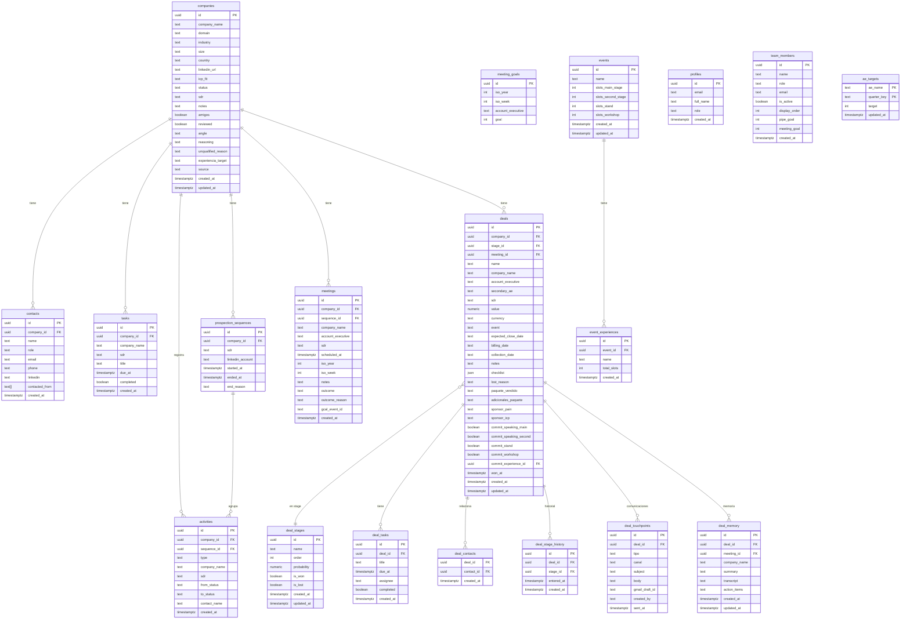

## Motor

PostgreSQL 16 gestionado por Supabase. Row Level Security (RLS) habilitado en todas las tablas. El proyecto usa la versión PostgREST 14.5 (ver `src/integrations/supabase/types.ts`).

**Proyecto:** `esuyjulkvrylglncenhe`  
**URL:** `https://esuyjulkvrylglncenhe.supabase.co`

## Diagrama ER



## Tablas

### `companies`
Registro principal de cada empresa prospectada.

| Columna | Tipo | Descripción |
|---------|------|-------------|
| `id` | uuid | PK, generado automáticamente |
| `company_name` | text | Nombre de la empresa |
| `domain` | text | Dominio web |
| `industry` | text | Sector |
| `size` | text | `SMB` \| `MID` \| `ENTERPRISE` |
| `country` | text | País |
| `linkedin_url` | text | URL del perfil LinkedIn |
| `icp_fit` | text | `ABM` \| `HIGH` \| `MID` \| `MAYBE` |
| `status` | text | Estado en el pipeline (ver `company.ts`) |
| `sdr` | text | SDR asignado (nombre libre) |
| `amigos` | boolean | Contacto de red conocida |
| `reviewed` | boolean | Revisado por AE |
| `angle` | text | `Hiring` \| `Brand` \| `Enterprise` \| `Partnerships` |
| `source` | text | Origen del lead |
| `unqualified_reason` | text | Razón de descarte |
| `experiencia_target` | text | Experiencia objetivo del evento |

**Estados válidos del pipeline** (`CompanyStatus` en `src/types/company.ts`):
`por_contactar` → `contactado` → `follow_up_1` → `follow_up_2` → `en_conversacion` → `agendado` → `reagendar` / `no_answer` / `no_interesado` / `unqualified` / `unqualified_post_meeting`

---

### `contacts`
Contactos vinculados a una empresa.

| Columna | Tipo | Descripción |
|---------|------|-------------|
| `company_id` | uuid FK | Empresa a la que pertenece |
| `name` | text | Nombre del contacto |
| `role` | text | Cargo |
| `linkedin` | text | URL LinkedIn (usado como clave de unicidad) |
| `contacted_from` | text[] | Cuentas LinkedIn desde las que fue contactado |

---

### `tasks`
Tareas de seguimiento SDR, asociadas a una empresa.

| Columna | Tipo | Descripción |
|---------|------|-------------|
| `company_id` | uuid FK | Empresa relacionada |
| `company_name` | text | Nombre (denormalizado para queries sin join) |
| `sdr` | text | SDR propietario |
| `title` | text | Descripción de la tarea |
| `due_at` | timestamptz | Fecha límite |
| `completed` | boolean | Completada o no |

---

### `activities`
Log inmutable de eventos: cambios de estado, contactos añadidos, outcomes de reuniones.

| Columna | Tipo | Descripción |
|---------|------|-------------|
| `type` | text | `status_change` \| `contact_added` \| `meeting_outcome` |
| `from_status` / `to_status` | text | Para `status_change` |
| `contact_name` | text | Para `contact_added` |
| `sequence_id` | uuid FK | Secuencia de prospección activa al momento |

---

### `meetings`
Reuniones de discovery agendadas.

| Columna | Tipo | Descripción |
|---------|------|-------------|
| `account_executive` | text | AE asignado |
| `sdr` | text | SDR que agendó |
| `iso_year` / `iso_week` | int | Semana ISO de la reunión |
| `outcome` | text | `qualified` \| `unqualified` \| `no_show` |
| `gcal_event_id` | text | ID del evento en Google Calendar |

---

### `prospection_sequences`
Cada asignación de un SDR a una empresa crea una nueva secuencia. Cuando se reasigna, la secuencia anterior se cierra.

| Columna | Tipo | Descripción |
|---------|------|-------------|
| `linkedin_account` | text | Cuenta LinkedIn usada |
| `ended_at` | timestamptz | NULL si activa |
| `end_reason` | text | `reasignado` u otro motivo |

---

### `deals`
Deals del pipeline de ventas (AE).

| Columna | Tipo | Descripción |
|---------|------|-------------|
| `stage_id` | uuid FK | Stage actual del kanban |
| `meeting_id` | uuid FK | Reunión de discovery que originó el deal |
| `value` | numeric | Valor en USD |
| `currency` | text | `USD` por defecto |
| `event` | text | Evento Colombia Tech Week asociado |
| `paquete_vendido` | text | Nombre del paquete de patrocinio |
| `commit_*` | boolean | Items del commit (speaking, stand, workshop) |
| `won_at` | timestamptz | Timestamp de cierre ganado |
| `checklist` | json | Checklist de entregables (estructura libre) |

---

### `deal_stages`
Etapas configurables del pipeline de deals.

| Columna | Tipo | Descripción |
|---------|------|-------------|
| `order` | int | Posición en el kanban |
| `probability` | numeric | % de probabilidad (0–100) |
| `is_won` | boolean | Stage de cierre ganado |
| `is_lost` | boolean | Stage de pérdida |

---

### `profiles`
Perfiles de usuario sincronizados desde `auth.users` vía trigger.

| Columna | Tipo | Descripción |
|---------|------|-------------|
| `id` | uuid FK | `auth.users.id` |
| `role` | text | `admin` \| `user` |

---

### `team_members`
Roster dinámico del equipo comercial.

| Columna | Tipo | Descripción |
|---------|------|-------------|
| `role` | text | `sdr` \| `ae` \| `secondary_ae` |
| `is_active` | boolean | Si aparece en selectores y métricas |
| `display_order` | int | Orden de aparición en UI |
| `pipe_goal` | int | Meta de pipeline mensual (USD) |
| `meeting_goal` | int | Meta de reuniones mensuales |

---

### `ae_targets`
Metas de ingresos trimestrales por AE.

| Columna | Tipo | Descripción |
|---------|------|-------------|
| `ae_name` | text PK | Nombre del AE |
| `quarter_key` | text PK | Ej. `Q2-2026` |
| `target` | int | Meta en USD |

---

## Políticas RLS

Todas las tablas tienen RLS habilitado. El patrón general es: cualquier usuario autenticado puede leer y escribir. Solo `profiles` tiene restricciones adicionales.

| Tabla | SELECT | INSERT | UPDATE | DELETE |
|-------|--------|--------|--------|--------|
| `companies` | authenticated | authenticated | authenticated | authenticated |
| `contacts` | authenticated | authenticated | authenticated | authenticated |
| `tasks` | authenticated | authenticated | authenticated | authenticated |
| `activities` | authenticated | authenticated | authenticated | authenticated |
| `meetings` | authenticated | authenticated | authenticated | authenticated |
| `meeting_goals` | authenticated | authenticated | authenticated | authenticated |
| `prospection_sequences` | authenticated | authenticated | authenticated | authenticated |
| `deals` | authenticated | authenticated | authenticated | authenticated |
| `deal_stages` | authenticated | authenticated | authenticated | authenticated |
| `deal_tasks` | authenticated | authenticated | authenticated | authenticated |
| `deal_contacts` | authenticated | authenticated | authenticated | authenticated |
| `deal_stage_history` | authenticated | authenticated | authenticated | authenticated |
| `deal_touchpoints` | authenticated | authenticated | authenticated | authenticated |
| `deal_memory` | authenticated | authenticated | authenticated | authenticated |
| `events` | authenticated | authenticated | authenticated | authenticated |
| `event_experiences` | authenticated | authenticated | authenticated | authenticated |
| `team_members` | authenticated | authenticated | authenticated | authenticated |
| `ae_targets` | authenticated | authenticated | authenticated | authenticated |
| `profiles` | `auth.uid() IS NOT NULL` | `true` (service) | `auth.uid() = id` | — |

**Política especial de `profiles`** (`supabase/migrations/20260625120000_profiles_auth.sql`):
- Los usuarios solo pueden actualizar su propio perfil.
- Los INSERTs los hace el trigger del sistema (`handle_new_user`), por eso `WITH CHECK (true)`.

## Triggers y funciones

### `handle_new_user`
Se ejecuta `AFTER INSERT ON auth.users`. Crea automáticamente un registro en `profiles`. Si no existe ningún admin todavía, asigna `role = 'admin'` al primer usuario.

```sql
-- supabase/migrations/20260625120000_profiles_auth.sql
CREATE TRIGGER on_auth_user_created
  AFTER INSERT ON auth.users
  FOR EACH ROW EXECUTE PROCEDURE public.handle_new_user();
```

## Cómo correr migraciones

Las migraciones son archivos SQL en `supabase/migrations/`. Para aplicarlas:

<Tabs>
  <Tab title="Supabase CLI (local)">
    ```bash
    supabase db push
    ```
    Aplica todas las migraciones pendientes al proyecto remoto configurado en `supabase/config.toml`.
  </Tab>
  <Tab title="SQL Editor manual">
    1. Abre Supabase Dashboard → SQL Editor.
    2. Pega el contenido del archivo de migración.
    3. Ejecuta.
  </Tab>
</Tabs>

<Warning>
Las migraciones `20260703000000_team_members.sql` y `20260703000001_team_goals.sql` **no han sido aplicadas aún** al proyecto remoto. Deben aplicarse manualmente para habilitar el equipo dinámico y las metas configurables.
</Warning>

## Seed data

Los siguientes datos iniciales están en las migraciones de `team_members`:

**SDRs:** César, Jissad, Juan, Dani, Majo, Self AE  
**AEs:** Nico, Majo, Santi, Toqui, Otro AE  
**Sub-AEs:** Nath, Liz, Lau, Fernando, Carlos Alberto  
**Targets Q2-2026:** Toqui/Nico → $140k, Santi/Majo → $210k
