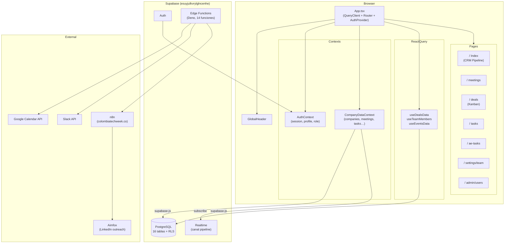

## ¿Qué es este sistema?

Colombia Tech Sales CRM es una aplicación web interna de gestión de pipeline comercial construida para el equipo de ventas de Colombia Tech Week. Centraliza el ciclo completo de prospección B2B: desde la calificación inicial de empresas patrocinantes hasta el cierre de deals, pasando por la gestión de reuniones de discovery, tareas de seguimiento, y reportes de cumplimiento de metas.

El sistema reemplaza hojas de cálculo y flujos manuales por un pipeline de kanban en tiempo real, con trazabilidad de actividades, integración con Google Calendar y notificaciones automáticas a Slack.

## Problema que resuelve

El equipo de ventas de Colombia Tech Week prospecta cientos de empresas por ciclo de evento. Sin una herramienta centralizada:

- Los SDRs no tienen visibilidad del estado de otras carteras.
- Los AEs no pueden rastrear avance vs. meta de ingresos trimestral.
- La gerencia no puede ver el pipeline consolidado en tiempo real.
- Las reuniones agendadas no quedan registradas ni generan eventos en Google Calendar automáticamente.

## Quién lo usa

| Rol | Acceso |
|-----|--------|
| SDR | Pipeline de empresas, tareas propias, agenda de reuniones |
| AE (Account Executive) | Dashboard de deals, metas de cierre, tareas de deals |
| Admin | Todo lo anterior + gestión de usuarios |

## Stack tecnológico

<CardGroup cols={2}>
  <Card title="Frontend" icon="react">
    React 18.3.1 · TypeScript 5.8.3 · Vite 5.4.19  
    TailwindCSS 3.4.17 · Radix UI · shadcn/ui  
    React Router 6.30.1
  </Card>
  <Card title="Backend / DB" icon="database">
    Supabase (PostgreSQL) · Row Level Security  
    Supabase Auth · Supabase Realtime  
    Supabase Edge Functions (Deno)
  </Card>
  <Card title="Estado y datos" icon="arrows-rotate">
    @tanstack/react-query 5.83.0 (deals, team)  
    CompanyDataContext con useState + Realtime  
    (CRM pipeline)
  </Card>
  <Card title="Integraciones externas" icon="plug">
    Google Calendar · Slack · n8n · Aimfox  
    Lovable connector gateway
  </Card>
</CardGroup>

### Dependencias clave por categoría

| Librería | Versión | Uso |
|----------|---------|-----|
| `@supabase/supabase-js` | 2.106.0 | Cliente Supabase (DB, auth, funciones) |
| `@tanstack/react-query` | 5.83.0 | Data fetching deals y team members |
| `@dnd-kit/core` | 6.3.1 | Drag & drop kanban de deals |
| `recharts` | 2.15.4 | Gráficas en Meetings y Dashboard |
| `react-hook-form` | 7.61.1 | Formularios |
| `zod` | 3.25.76 | Validación de schemas |
| `date-fns` | 3.6.0 | Manipulación de fechas / semanas ISO |
| `xlsx` | 0.18.5 | Exportación a Excel |
| `sonner` | 1.7.4 | Toast notifications |
| `lucide-react` | 0.462.0 | Iconografía |

## Diagrama de componentes

## Estado del proyecto

El sistema está en producción activa en [crm.colombiatechweek.co](https://crm.colombiatechweek.co). Las migraciones `20260703000000_team_members.sql` y `20260703000001_team_goals.sql` deben aplicarse manualmente en el SQL Editor de Supabase para activar las funcionalidades de equipo dinámico y metas configurables.
