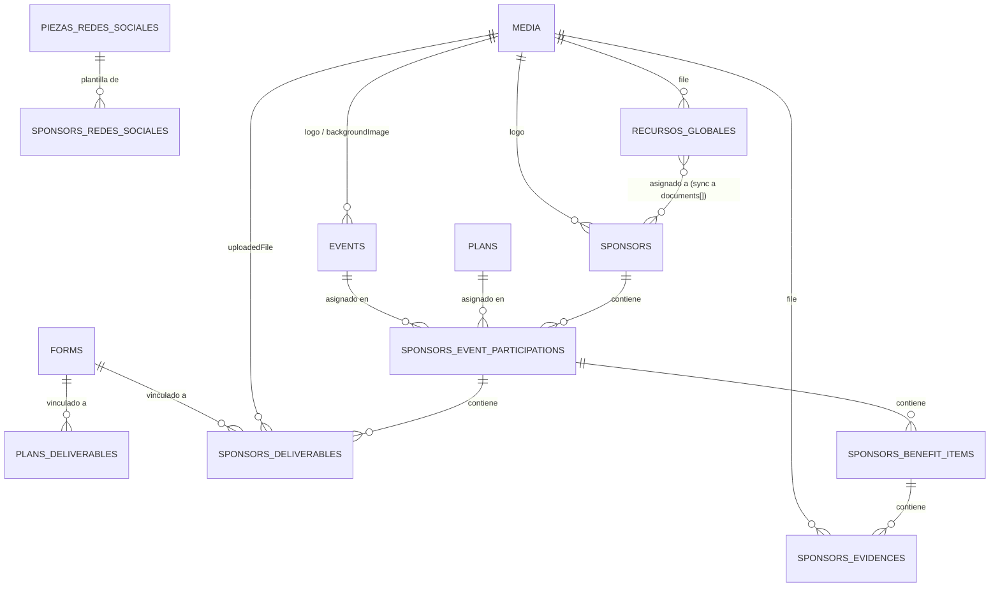

## Cómo se define el schema

El proyecto **no usa migraciones SQL manuales**: no existe una carpeta `migrations/` ni `supabase/` en el repo. El schema de Postgres se genera y sincroniza a partir de las **colecciones de Payload** (`src/collections/*.ts`) a través del adaptador `@payloadcms/db-postgres`, configurado en `src/payload.config.ts`:

```ts
db: postgresAdapter({
  pool: {
    connectionString: process.env.DATABASE_URL || '',
  },
}),
```

`db.defaultIDType` (visible en `src/payload-types.ts`) es `number` — es decir, **los IDs son enteros autoincrementales**, no UUID.

<Warning>
**TODO**: no hay migraciones versionadas en el repo, lo que sugiere que Payload está corriendo en modo *push* (sincroniza el schema directo contra la base de datos al iniciar). Esto es razonable en desarrollo pero riesgoso en producción (cambios de schema sin historial ni rollback). Verificar si el equipo tiene un flujo de migraciones de Payload (`payload migrate:create`) fuera de este repo, o si de verdad se depende de *push* también en producción.
</Warning>

## Colecciones (tablas lógicas)

Cada colección de Payload se traduce en una tabla base en Postgres (nombre = `slug` de la colección), más tablas hijas autogeneradas por Payload para cada campo de tipo `array` (una fila por elemento del array, con FK al padre). Los nombres exactos de esas tablas hijas y sus columnas no están documentados en el repo (no hay SQL ni migraciones) — están **inferidos** de la configuración de campos; para confirmarlos hay que inspeccionar la base de datos real. Se marcan como TODO donde aplica.

### `users`

Colección de autenticación para el equipo interno (`auth: { useAPIKey: true }`). Sin campos de negocio propios — solo los que Payload agrega a toda colección `auth`.

| Campo | Tipo | Notas |
|---|---|---|
| `id` | `number` | PK |
| `email` | `string` | requerido, provisto por Payload auth |
| `password` / `hash` / `salt` | — | gestión de credenciales de Payload |
| `resetPasswordToken`, `resetPasswordExpiration` | — | flujo de "olvidé mi contraseña" |
| `loginAttempts`, `lockUntil` | — | rate limiting de login |
| `enableAPIKey`, `apiKey`, `apiKeyIndex` | — | autenticación por API Key |
| `sessions[]` | array (`id`, `createdAt`, `expiresAt`) | sesiones activas |

### `sponsors`

La colección central del dominio. También es una colección `auth: true` — **cada sponsor es un usuario autenticable** (mismos campos de auth que `users`, más los campos de negocio):

| Campo | Tipo | Notas |
|---|---|---|
| `id` | `number` | PK |
| `companyName` | `string` | requerido |
| `logo` | relación → `media` | opcional |
| `eventsSummary`, `currentPlanName` | `string` | campos calculados (hook `beforeChange`), ocultos en el admin, usados como columnas de listado |
| `contactInfo` | group (`fullName`, `whatsapp`, `corporateEmail`, `linkedin`) | — |
| `whatsappGroup` | group (`link`, `joined`) | — |
| `documents[]` | array (`name`, `tipo`: `archivo`\|`url`, `file` → `media`, `url`, `recursoGlobalId`) | recursos propios + los sincronizados desde `recursos-globales` (enlazados por `recursoGlobalId`) |
| `eventParticipations[]` | array | **la estructura más profunda del sistema** — ver detalle abajo |
| campos de auth | — | mismos que `users` (`email`, `password`, `sessions`, etc.) |

`eventParticipations[]` — un elemento por cada Evento al que el sponsor está asignado:

| Campo | Tipo | Notas |
|---|---|---|
| `isCurrent` | `boolean` | calculado — evento "actual" del sponsor (el próximo futuro más cercano, o el pasado más reciente si no hay futuros) |
| `event` | relación → `events` | requerido |
| `plan` | relación → `plans` | requerido |
| `strategy` | group (`description`, `eventObjectives`, `brandDifferentiator`) | — |
| `meetings[]` | array (`name`, `projectedMonth`, `calendlyLink`, `platform`, `status`: `pending`\|`scheduled`\|`completed`, `scheduledDate`) | clonado desde `event.meetingTemplates` la primera vez |
| `deliverables[]` | array (`planDeliverableId`, `benefitCategory`, `itemName`, `type`, `actionUrl`, `status`, `dueDate`, `unlockDate`, `uploadedFile` → `media`, `uploadedText`, `uploadedLink`, `relatedItemNames` (json), `formId` → `forms`, `formResponse` (json), `source`: `plan`\|`custom`) | clonado desde `plan.benefits[].deliverables` |
| `benefitItems[]` | array (`planBenefitItemId`, `benefitCategory`, `itemName`, `status`: `not_started`\|`in_progress`\|`completed`, `evidences[]`, `source`) | clonado desde `plan.benefits[].items` |
| `evidences[]` (dentro de cada `benefitItem`) | array (`type`: `image`\|`document`\|`text`\|`link`, `file` → `media`, `text`, `link`) | subidas por el equipo interno como prueba de ejecución del beneficio |
| `redesSociales[]` | array (`pieza` → `piezas-redes-sociales`, `archivo` → `media`) | pieza gráfica asignada + archivo específico del sponsor |

### `events`

| Campo | Tipo | Notas |
|---|---|---|
| `id` | `number` | PK |
| `title`, `startDate`, `endDate` | — | requeridos |
| `logo`, `backgroundImage` | relación → `media` | identidad visual |
| `location` | group (`venue`, `city`, `country`, `details`) | — |
| `journey` | group → `moments[]` → `items[]` (`momentTitle`, `itemTitle`, `date1`, `date2`) | calendario/journey del evento, mostrado en `/dashboard/calendario` |
| `meetingTemplates[]` | array (`name`, `projectedMonth`, `calendlyLink`, `platform`) | plantillas que se clonan a `sponsors.eventParticipations[].meetings` |

### `plans`

| Campo | Tipo | Notas |
|---|---|---|
| `id` | `number` | PK |
| `name` | `string` | requerido |
| `addonsDiscount` | `number` | % de descuento en add-ons |
| `benefits[]` | array (`benefitName`, `hasDeliverable`, `unlockDate`, `deliverables[]`, `items[]`) | catálogo de beneficios del tier |
| `deliverables[]` (dentro de cada `benefit`) | array (`deliverableName`, `type`, `actionUrl`, `formId` → `forms`, `dueDate`, `unlockDate`, `relatedItems` (json)) | plantilla de entregables exigidos |
| `items[]` (dentro de cada `benefit`) | array (`itemName`) | ítems ejecutables por el equipo interno |

### `forms`

Formularios dinámicos configurables desde el admin, referenciados por `deliverables[].formId` (en `sponsors` y `plans`).

| Campo | Tipo | Notas |
|---|---|---|
| `id` | `number` | PK |
| `title`, `description` | — | — |
| `referenceTitle`, `referenceImage` → `media`, `referencePdf` → `media`, `referenceLink` | — | material de referencia mostrado al sponsor antes del formulario |
| `fields[]` | array (`label`, `fieldKey` (autogenerado, oculto), `type`: `text`\|`textarea`\|`number`\|`date`\|`select`\|`checkbox`\|`image`\|`link`\|`email`, `required`, `placeholder`, `options[]`) | `fieldKey` se deriva del `label` vía slugify en el hook `beforeChange` |

### `piezas-redes-sociales`

| Campo | Tipo | Notas |
|---|---|---|
| `id` | `number` | PK |
| `nombre` | `string` | requerido |
| `formatoTipo` | `select`: `imagen`\|`pdf`\|`link` | requerido |
| `urlLink` | `string` | solo si `formatoTipo === 'link'` |
| `fechaPublicacion`, `horaPublicacion` | `date` | fecha/hora sugeridas de publicación |
| `copySugerido` | `textarea` | — |

### `recursos-globales`

| Campo | Tipo | Notas |
|---|---|---|
| `id` | `number` | PK |
| `nombre`, `descripcion` | — | — |
| `tipo` | `select`: `archivo`\|`url` | requerido |
| `file` → `media` | — | solo si `tipo === 'archivo'` |
| `url` | `string` | solo si `tipo === 'url'` |
| `sponsors[]` | relación *hasMany* → `sponsors` | al modificarse, el hook `afterChange` sincroniza (agrega/quita/actualiza) una entrada espejo en `sponsors.documents[]` de cada sponsor afectado, usando `recursoGlobalId` como clave de correlación |

### `media`

| Campo | Tipo | Notas |
|---|---|---|
| `id` | `number` | PK |
| `alt` | `string` | autocompletado desde el nombre de archivo si se deja vacío |
| `url`, `thumbnailURL`, `filename`, `mimeType`, `filesize`, `width`, `height`, `focalX`, `focalY` | — | metadatos estándar de upload de Payload; el archivo binario en sí vive en Supabase Storage (S3), no en Postgres |

Tipos MIME permitidos: imágenes, PDF, PostScript/Illustrator, Office (Word/Excel/PowerPoint), texto plano, CSV, ZIP.

### Tablas de sistema de Payload

Presentes en `Config` (`src/payload-types.ts`) pero sin campos de negocio — administradas enteramente por el framework:

- `payload-kv` — almacén clave/valor interno.
- `payload-locked-documents` — bloqueo de documentos en edición concurrente (referencia polimórfica a cualquier colección).
- `payload-preferences` — preferencias de UI por usuario del admin.
- `payload-migrations` — tabla de control de migraciones de Payload (vacía/no usada activamente si el proyecto corre en modo *push*; TODO confirmar).

## Relaciones (resumen)



*(Los nombres en mayúsculas/snake_case de las tablas hijas de arrays son ilustrativos de la convención de Payload; los nombres físicos reales no fueron verificados contra la base de datos — TODO.)*

## Row Level Security (RLS)

<Warning>
**No se encontró ninguna política de RLS, ni configuración de Supabase Auth/PostgREST, en este repositorio.** Payload se conecta a Postgres con una **cadena de conexión directa** (`pg` vía `DATABASE_URL`), no a través de la API REST de Supabase (PostgREST) — por lo tanto, aunque el proyecto de Supabase tuviera RLS habilitado a nivel de tabla, **no aplicaría a las queries que hace Payload**, ya que esas queries no pasan por el rol `anon`/`authenticated` de PostgREST sino por el usuario/rol de la cadena de conexión.
</Warning>

El control de acceso real en este sistema vive **a nivel de aplicación, en Payload**, mediante la propiedad `access` de cada colección:

- `media` es la **única** colección con `access` explícito: `read: () => true` (lectura pública, necesaria para poder servir imágenes/archivos sin autenticación).
- Ninguna otra colección (`users`, `sponsors`, `events`, `plans`, `forms`, `piezas-redes-sociales`, `recursos-globales`) define `access` — usan el comportamiento por defecto de Payload.

**TODO**: no se verificó en esta revisión cuál es el comportamiento por defecto exacto que aplica Payload 3 a colecciones sin `access` definido (esto determina si, por ejemplo, un `sponsor` autenticado podría leer o modificar el documento de otro `sponsor` vía API REST/GraphQL). Esto es un punto de seguridad importante a confirmar con el equipo o con la documentación oficial de Payload antes de considerar el sistema "cerrado" por defecto.

## Almacenamiento de archivos vs. base de datos

Los binarios de la colección `media` **no** se guardan en Postgres: el plugin `@payloadcms/storage-s3` los sube al bucket de Supabase Storage configurado (`S3_BUCKET` en el endpoint `S3_ENDPOINT`, `forcePathStyle: true`). Postgres solo guarda los metadatos (`filename`, `url`, `mimeType`, dimensiones, etc.).
